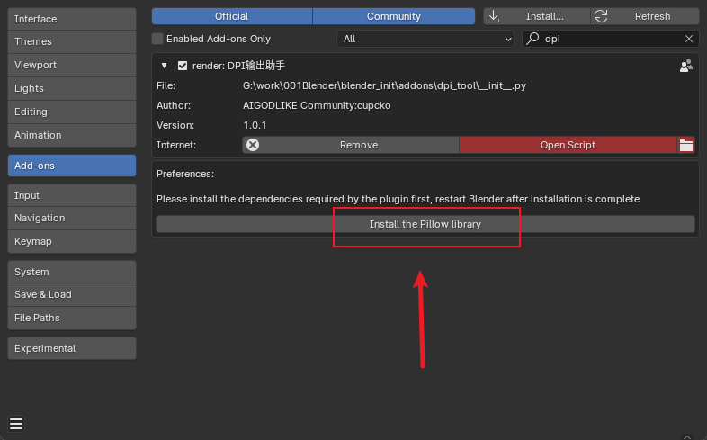
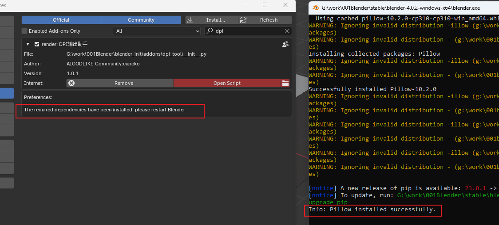
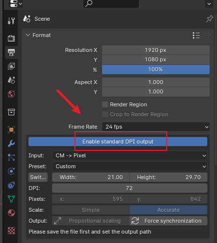
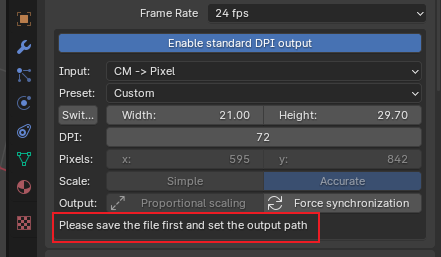
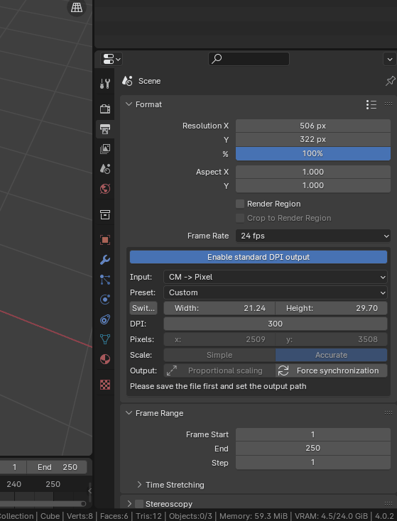

# dpi_tool
 Setting the DPI of an image in Blender

https://github.com/user-attachments/assets/80cfcbdb-b8a9-448e-9049-6e259ae85f6a

## catalog目录

-   [ ] [Install plugin安装插件](#安装插件)
-   [ ] [Plugin usage插件使用](#插件使用)
    -   [ ] [Enable启用](#启用)
-   [ ] [Output path输出路径](#输出路径)
    -   [ ] [Customize output size自定义输出大小](#自定义输出大小)
    -   [ ] [Use presets使用预设](#使用预设)
        -   [ ] [Proportional adaptation等比自适应](#等比自适应)
        -   [ ] [Simple mode简单模式](#简单模式)
        -   [ ] [Precise mode精确模式](#精确模式)

## Install plugin安装插件
Click the "Install Pillow Library" button to install the necessary dependencies. Once the installation is complete, restart Blender.

点击安装pillow库按钮安装所需依赖,,安装完成后重启blender即可

## Plugin usage插件使用

### Enable启用

After clicking the "Enable" button, when you press F12 to output an image, it will include DPI information.

点击启用按钮后,按f12输出图片时,就可以携带dpi信息

## Output path输出路径

Before outputting the image, please set the output path.

输出图片前请设置输出路径

The rendered output image will carry DPI information.

渲染输出后图片便携带有dpi信息

### Customize output size自定义输出大小

In the input options, you can choose to adjust the paper size (cm) or pixel size (px), then set the DPI. You can preview the final output size.

输入选项中,可选择调整纸张大小(cm)或者像素大小(px),再设置dpi,可预览最终的输出大小

Finally, click the "Force Sync" button to configure the image output settings.

最后点击强制同步按钮即可配置好图片输出设置

After finishing, press F12 to output the image.

完成后按f12即可输出图片

### Use presets使用预设

#### Proportional adaptation

Proportional adaptation function can achieve a similar function to adjusting image size in Photoshop, scaling the image to the corresponding size proportionally.

等比自适应功能可以实现类似ps调成图像大小功能,按比例将图片缩放到对应大小

The scaling ratio is determined by the initial rendering resolution.

缩放比例由初始的渲染分辨率决定

#### Simple mode简单模式

Choosing the simple mode can interpolate and scale the initial rendering resolution to the final output resolution size.

选择简单模式可以将初始渲染分辨率插值缩放到最终的输出分辨率大小

#### Precise mode精确模式

Choosing the precise mode will render the final image size completely. You need to click the "Force Sync" button to set the final rendering resolution to the renderer.

选择精确模式会完整渲染最终图片大小,需要点击强制同步按钮设置最终渲染分辨率到渲染器
