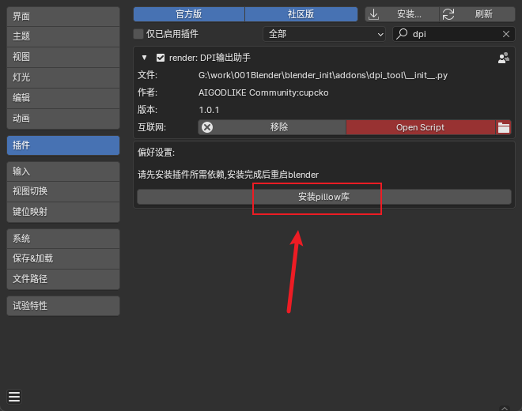
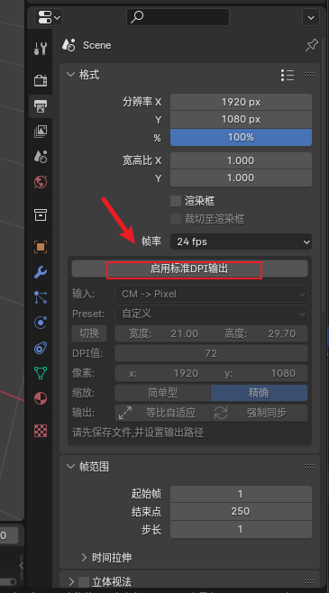
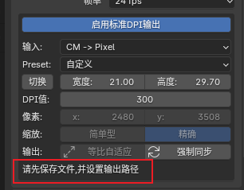
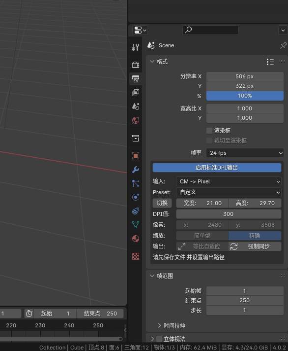
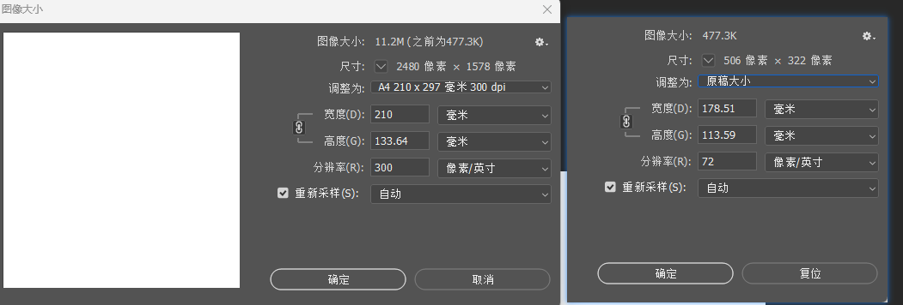

# dpi_tool
 Setting the DPI of an image in Blender
## 目录

-   [ ] [安装插件](#安装插件)
-   [ ] [插件使用](#插件使用)
    -   [ ] [启用](#启用)
-   [ ] [输出路径](#输出路径)
    -   [ ] [自定义输出大小](#自定义输出大小)
    -   [ ] [使用预设](#使用预设)
        -   [ ] [等比自适应](#等比自适应)
        -   [ ] [简单模式](#简单模式)
        -   [ ] [精确模式](#精确模式)

## 安装插件

点击安装pillow库按钮安装所需依赖,,安装完成后重启blender即可

## 插件使用

### 启用

点击启用按钮后,按f12输出图片时,就可以携带dpi信息

## 输出路径

输出图片前请设置输出路径

渲染输出后图片便携带有dpi信息

### 自定义输出大小

输入选项中,可选择调整纸张大小(cm)或者像素大小(px),再设置dpi,可预览最终的输出大小

最后点击强制同步按钮即可配置好图片输出设置

完成后按f12即可输出图片

### 使用预设

#### 等比自适应

等比自适应功能可以实现类似ps调成图像大小功能,按比例将图片缩放到对应大小

缩放比例由初始的渲染分辨率决定

#### 简单模式

选择简单模式可以将初始渲染分辨率插值缩放到最终的输出分辨率大小

#### 精确模式

选择精确模式会完整渲染最终图片大小,需要点击强制同步按钮设置最终渲染分辨率到渲染器
